# Cas d'utilisation des notifications

Ce document décrit les différents cas d'utilisation pour l'envoi de notifications aux utilisateurs, en prenant en compte les contraintes de disponibilité du serveur.

## Configuration des notifications

La configuration des notifications comprend les éléments suivants :
- Une deadline à T0
- Une notification à T-1h
- Une notification à T-6h
- Une notification à T-12h
- Une notification à T-20h

```mermaid
gantt
    title Configuration des notifications
    dateFormat  HH:mm
    axisFormat %H:%M
   todayMarker off
    
    section Configuration
    Deadline (T0)    :milestone, 20:00, 0m
    Notification T-1h :milestone, 19:00, 0m
    Notification T-6h :milestone, 14:00, 0m
    Notification T-12h :milestone, 08:00, 0m
    Notification T-20h :milestone, 00:00, 0m
```

## Règles de gestion

1. Le serveur peut être arrêté à tout moment
2. Si une notification est manquée pendant l'arrêt du serveur :
   - Si la prochaine notification est à plus d'une heure du redémarrage : on envoie la notification manquée
   - Si la prochaine notification est à moins d'une heure du redémarrage : on ignore la notification manquée
3. La dernière notification (celle la plus proche de la deadline) est toujours envoyée, sauf si la deadline est dépassée

## Cas d'utilisation

### Cas 1 : Notification manquée envoyée au redémarrage

Dans ce cas, le serveur est arrêté pendant la notification T-12h (8h00). Il redémarre à 10h00, et la prochaine notification (T-6h) est prévue à 14h00. Comme il y a plus d'une heure entre le redémarrage et la prochaine notification, la notification manquée de 8h00 est envoyée.

```mermaid
gantt
    title Cas 1 : Notification manquée envoyée au redémarrage
    dateFormat  HH:mm
    axisFormat %H:%M
   todayMarker off
    
    section État du serveur
    Serveur actif    :active, 00:00, 08:00
    Serveur inactif  :done, 08:00, 10:00
    Serveur actif    :active, 10:00, 20:00
    
    section Notifications
    T-20h (00h00)   :milestone, 00:00, 0m
    T-12h (8h00)    :milestone, 08:00, 0m
    T-12h envoyée   :milestone, 10:00, 0m
    T-6h (14h00)    :milestone, 14:00, 0m
    T-1h (19h00)    :milestone, 19:00, 0m
    Deadline (20h00) :milestone, 20:00, 0m
```

### Cas 2 : Notification manquée ignorée au redémarrage

Dans ce cas, le serveur est arrêté pendant la notification T-12h (8h00). Il redémarre à 13h00, et la prochaine notification (T-6h) est prévue à 14h00. Comme il y a moins d'une heure entre le redémarrage et la prochaine notification, la notification manquée de 8h00 est ignorée.

```mermaid
gantt
    title Cas 2 : Notification manquée ignorée au redémarrage
    dateFormat  HH:mm
    axisFormat %H:%M
   todayMarker off
    
    section État du serveur
    Serveur actif    :active, 00:00, 08:00
    Serveur inactif  :done, 08:00, 13:00
    Serveur actif    :active, 13:00, 20:00
    
    section Notifications
   T-20h (00h00)   :milestone, 00:00, 0m
    T-12h (8h00)    :milestone, 08:00, 0m
    T-6h (14h00)    :milestone, 14:00, 0m
    T-1h (19h00)    :milestone, 19:00, 0m
    Deadline (20h00) :milestone, 20:00, 0m
```

### Cas 3 : Dernière notification et deadline manquées

Dans ce cas, le serveur est arrêté pendant la dernière notification (T-1h à 19h00) et reste arrêté après la deadline (20h00). Aucune notification n'est envoyée car la deadline est dépassée.

```mermaid
gantt
    title Cas 3 : Dernière notification et deadline manquées
    dateFormat  HH:mm
    axisFormat %H:%M
   todayMarker off
    
    section État du serveur
    Serveur actif    :active, 00:00, 19:00
    Serveur inactif  :done, 19:00, 21:00
    
    section Notifications
   T-20h (00h00)   :milestone, 00:00, 0m
    T-12h (8h00)    :milestone, 08:00, 0m
    T-6h (14h00)    :milestone, 14:00, 0m
    T-1h (19h00)    :milestone, 19:00, 0m
    Deadline (20h00) :milestone, 20:00, 0m
``` 

